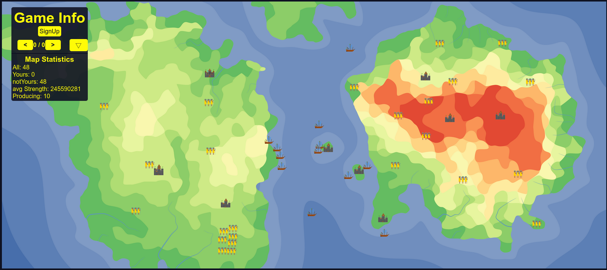

# Evil-Village

A small Multiplayer-Realtime-Strategy-Game

## How to Start

1. Use docker `docker compose up`

2. semi build
   1. `cd frontend`
   2. `npm i`
   3. `npm run buildToBackend`
   4. `cd ../backend`
   5. `npm i`
   6. `npm start`

3. Dev(2 command lines)
   1. Start terminal 1
   2. `cd backend`
   3. `npm i`
   4. `npm start`
   5. Start terminal 2
   6. `cd frontend`
   7. `npm i`
   8. `npm start`

Needs 2 or more Players to be good

Map: <https://azgaar.github.io/Fantasy-Map-Generator/>
